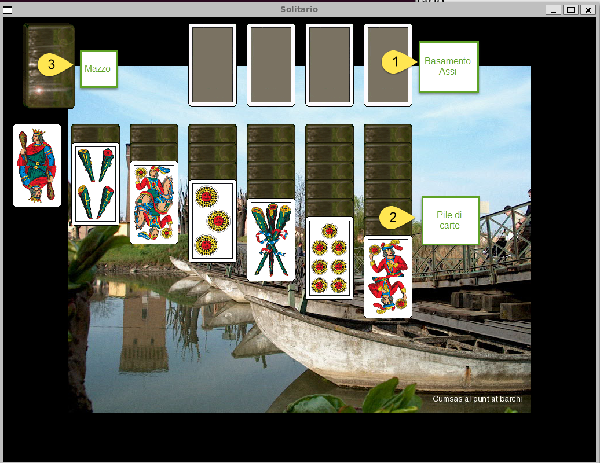

# Solitario versione 2.0

This is the a Solitaire game with 40 italian Briscola cards. The original game was the [Klondike](https://en.wikipedia.org/wiki/Klondike_(solitaire)) using 52 cards. This is an SDL2 project developed on Linux Ubuntu.  
This is also ported to Windows using MySys2.

## Supported Deck
- PIACENTINA
- BERGAMO
- BOLOGNA
- GENOVA
- MILANO
- NAPOLI
- PIEMONTE
- ROMAGNA
- SARDEGNA
- SICILIA
- TOSCANA
- TRENTO
- TREVISO
- TRIESTE

## Screeshots

## Help
[Help PDF file](./data/solitario.pdf) 
