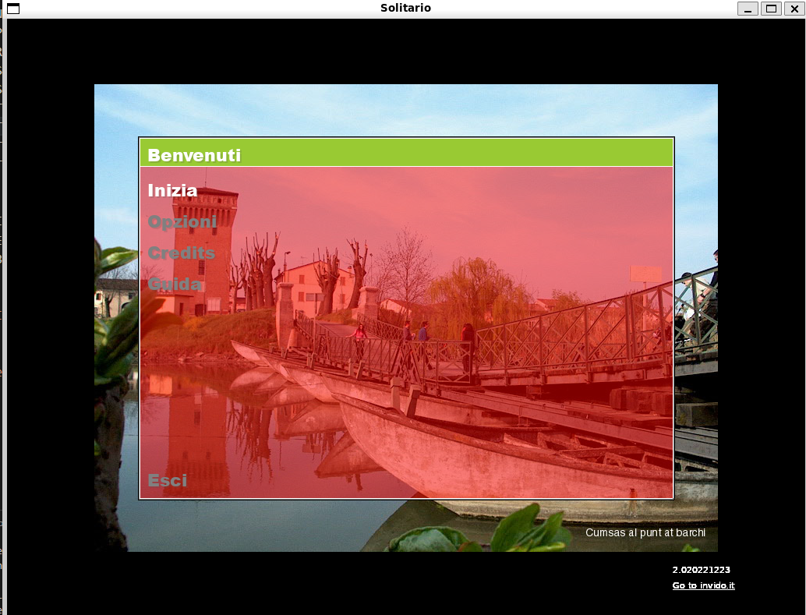
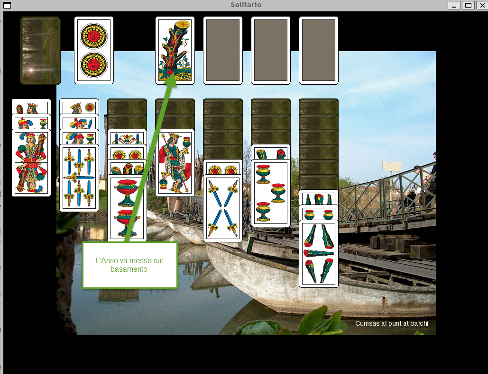

# Solitario versione 2.0

This is the a Solitaire game with 40 italian Briscola cards and the Tarock Piemontese with 56 cards. 
The original game and source of inspiration is the [Klondike](https://en.wikipedia.org/wiki/Klondike_(solitaire)). 
This is an SDL2 project developed on Linux Ubuntu.  
This is also ported to Windows using MSys2.

## Supported Deck
- PIACENTINA
- BERGAMO
- BOLOGNA
- GENOVA
- MILANO
- NAPOLI
- PIEMONTE
- ROMAGNA
- SARDEGNA
- SICILIA
- TOSCANA
- TRENTO
- TREVISO
- TRIESTE

## Supported Languages
- Italian
- English
- Breda Dialect

## Screeshots
  

## Help
[Help Italian PDF file](./data/solitario.pdf) 

## Credits
wings-of-the-wind.ogg: "Wings of the Wind" by GroovyLab80
wolmer-invido.ogg: La fisarmonica di Wolmer Beltrami
watermusic.it: water music free.
